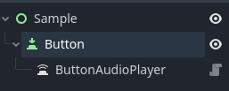

# Godot Button Audio Player
Add sound to any Button. 

Non-invasive design, configured through the inspector, does not require scripting, and supports any node inherited from BaseButton.

# How to Use
Add the ButtonAudioPlayer node to any Button node (Button, TextureButton, etc.), add the sound effects to play in the inspector. Each key event can correspond to a different sound effects.

